# Project Name

PARKME

## Table of Contents

- [Introduction](#introduction)
- [Features](#features)
- [Screenshots](#screenshots)
- [Getting Started](#getting-started)
  - [Prerequisites](#prerequisites)
  - [Installation](#installation)
- [Usage](#usage)
- [Admin Panel](#admin-panel)
- [Contributing](#contributing)
- [License](#license)

## Introduction

ParkMe is a user-friendly web-based platform that simplifies the process of finding and booking parking spaces. Join us in making urban parking hassle-free!
## Features

View Parking spaces available and their lots. 
Create a parking space from the admin panel.

### Screenshots

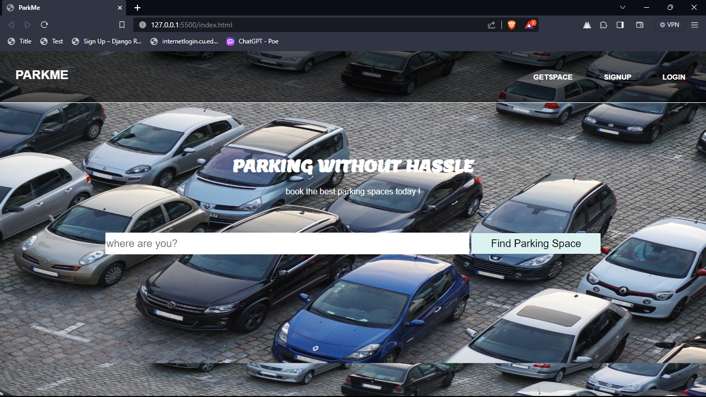
*Landing Page*

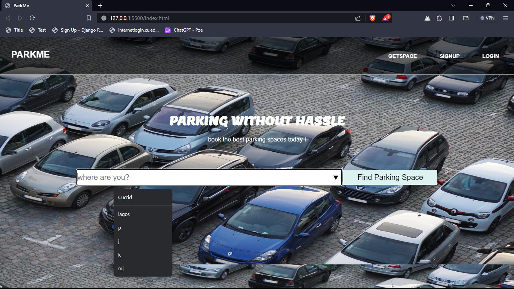
*Landing Page location selecting*

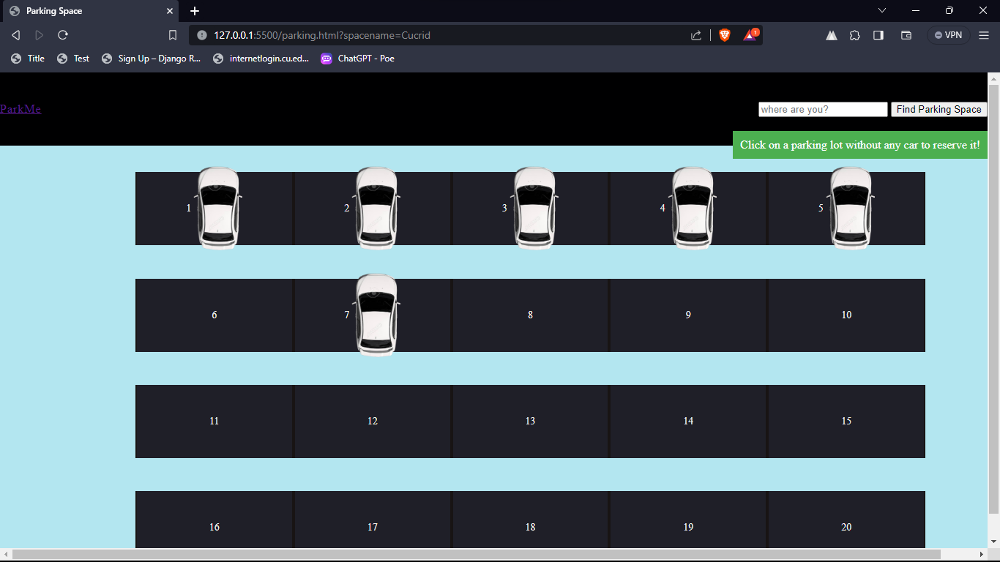
*View parking spaces for a particular location*

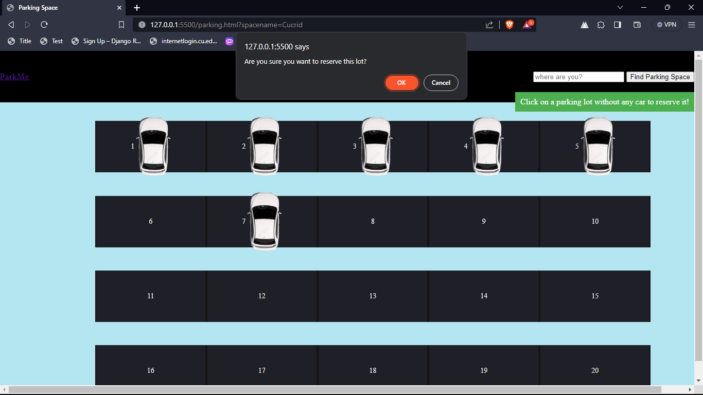
*Reservation of Lot No 6*

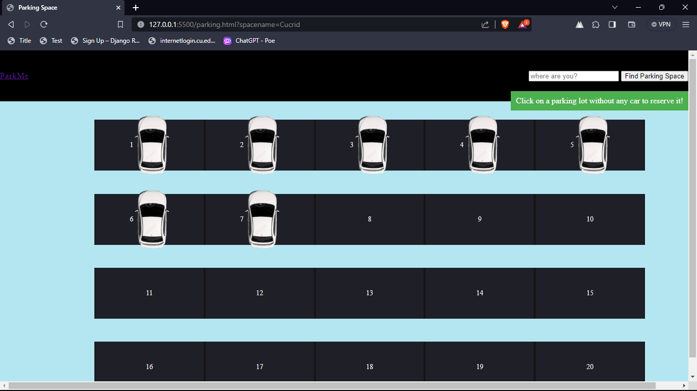
*Reservation of Lot No 6 after a successful execution*

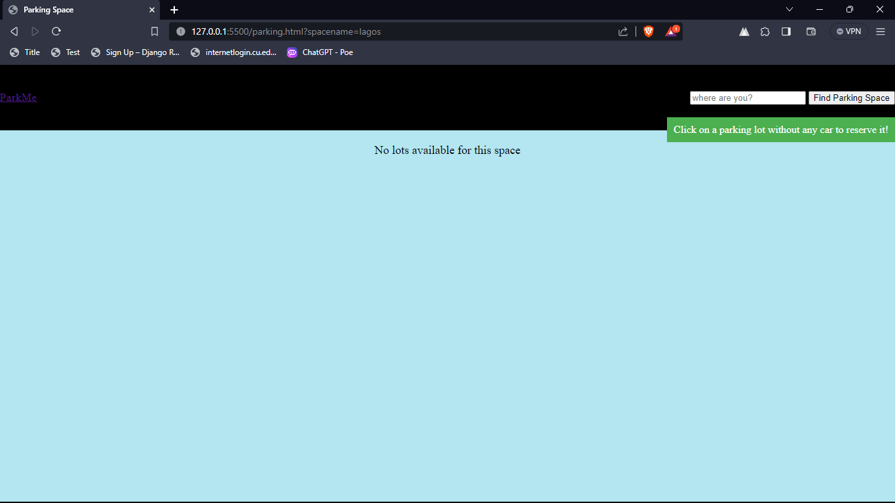
*No Lot available for a particular location*

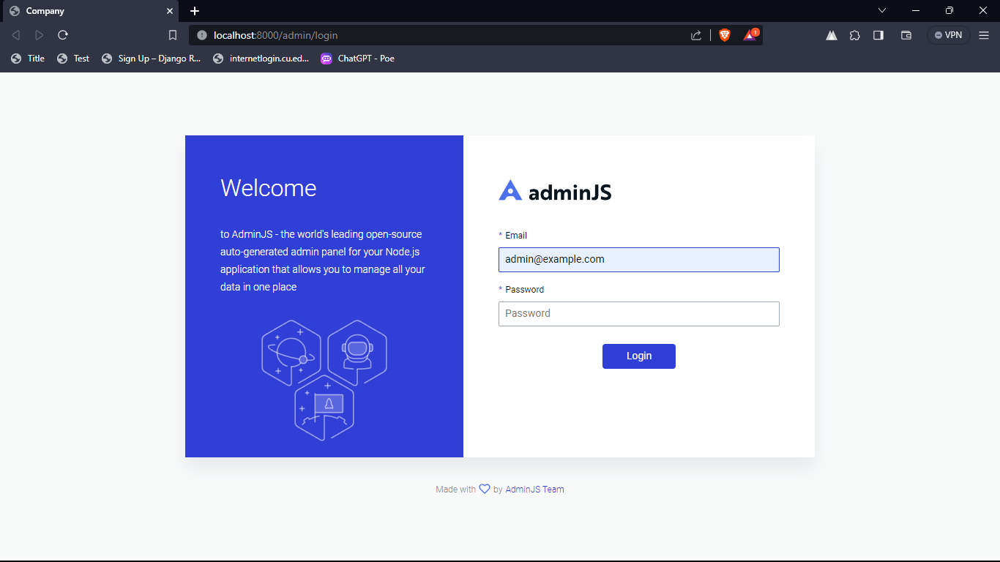
*Admin Login Page*

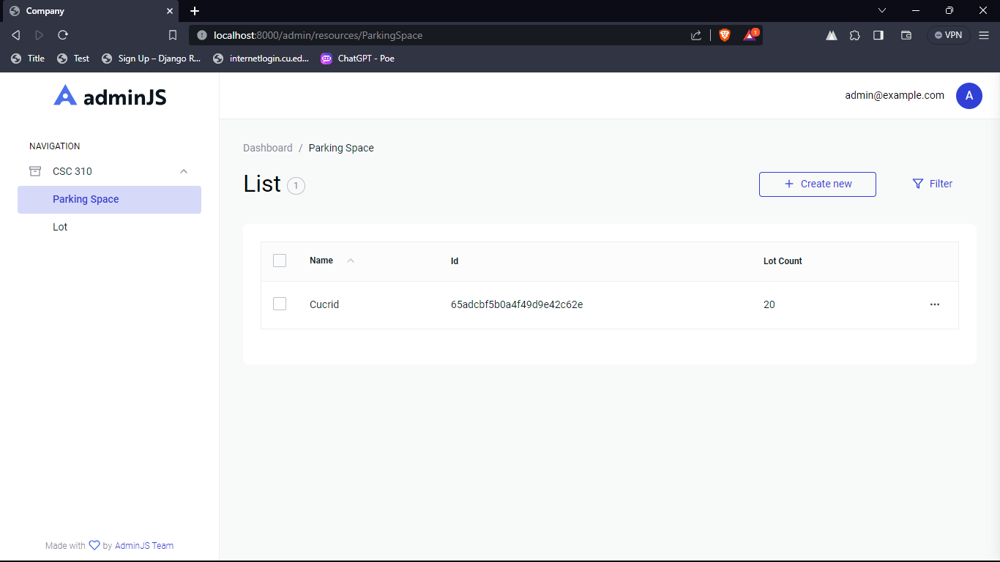
*Admin View of parking Spaces*

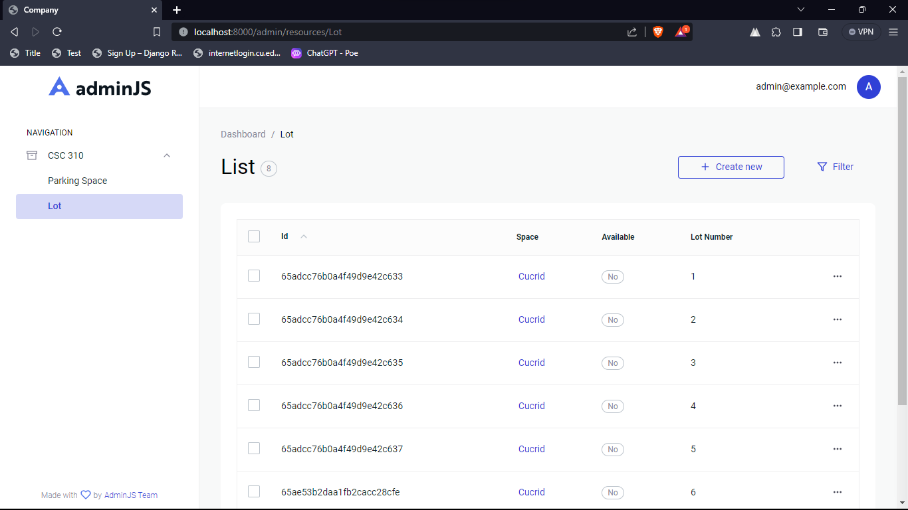
*Admin View of parking lots*

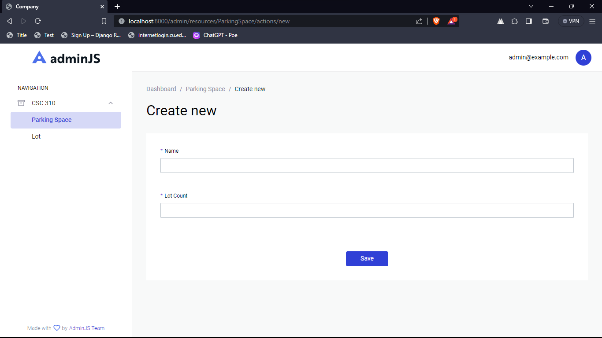
*Admin View of creating a space*

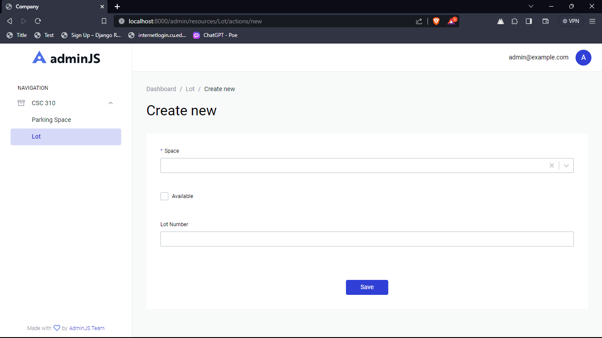
*Admin View of creating a lot*

## Getting Started

### Prerequisites

- Node.js
- npm or yarn

### Installation

Provide step-by-step instructions on how to install and set up your project.

```bash
# Clone the repository
git clone https://github.com/Mineshaye/ParkMeProject.git

# Change into the project directory
cd parkmeproject

# Install dependencies
npm install
# or
yarn install
```

### Admin Panel

```bash
cd admin-panel

npm install

npm run start
```
Login Screen email:
admin@example.com
password:
leave empty


